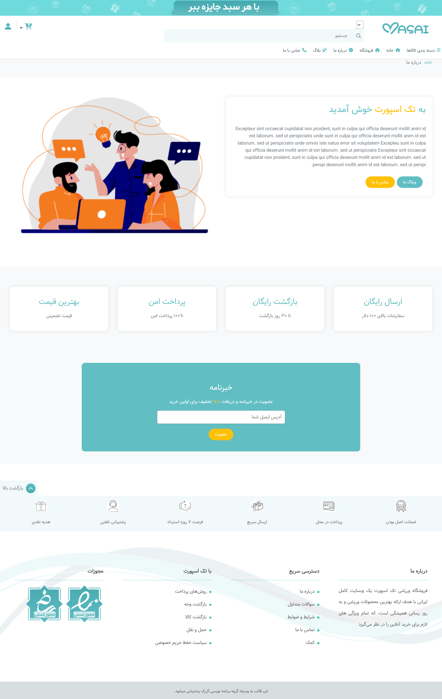
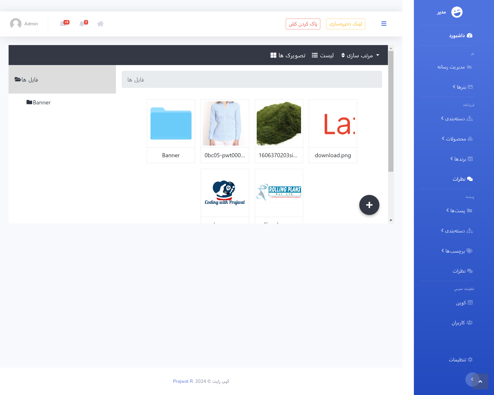
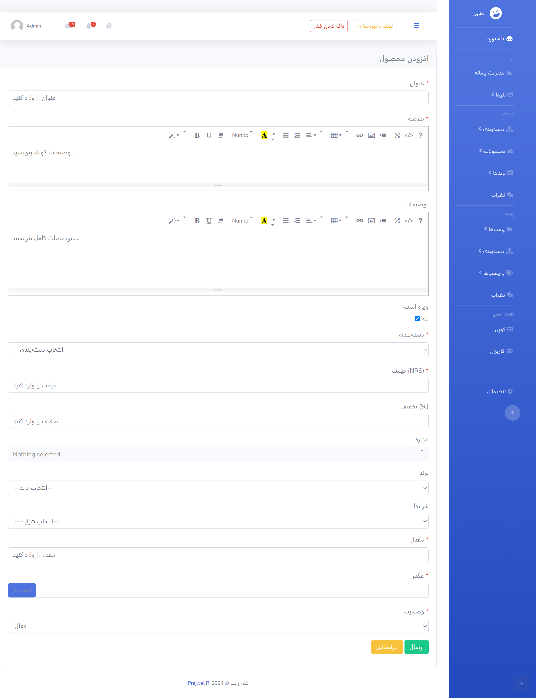
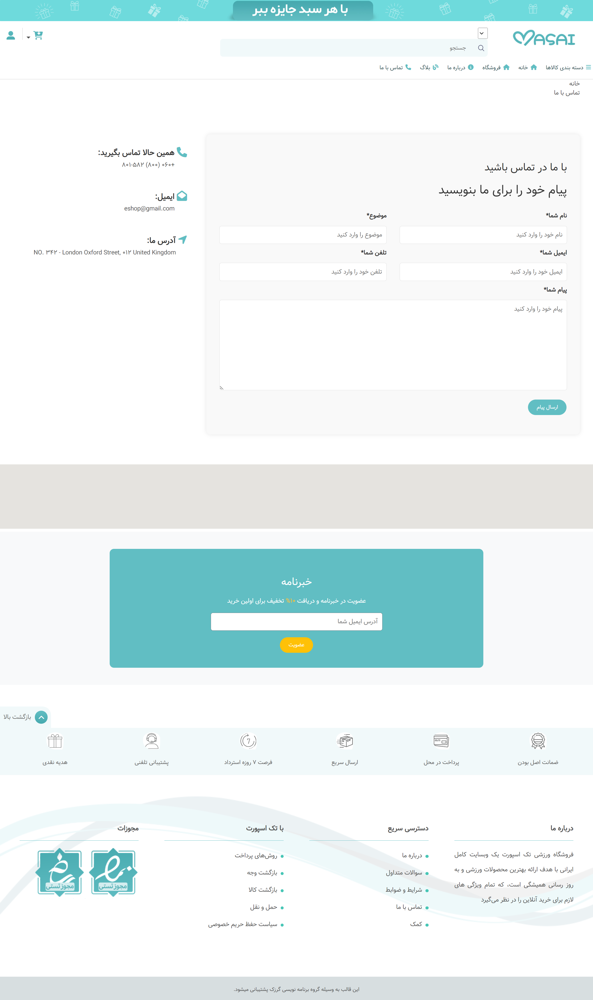
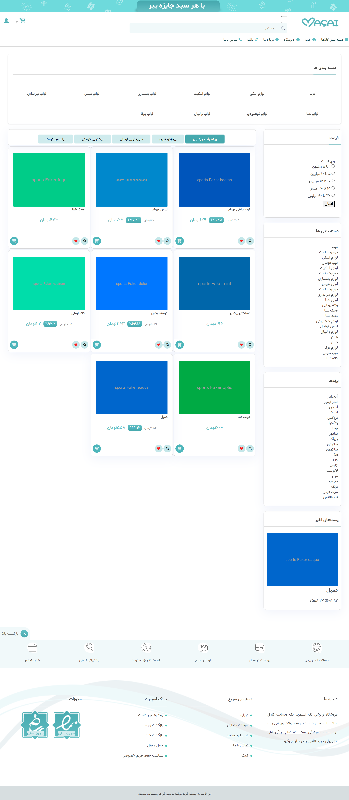
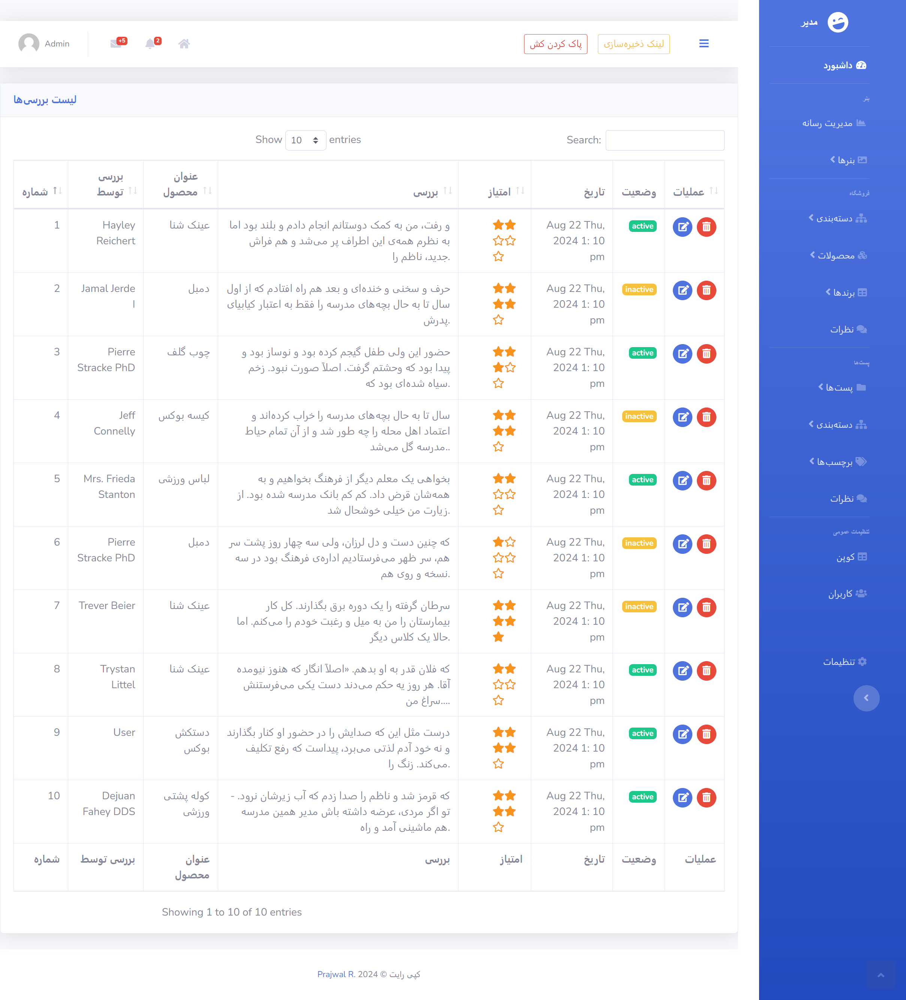

# LaravelCommerce

  

## وب‌سایت کامل تجارت الکترhdkونیک در Laravel 10

### ویژگی‌ها:
 ### ====== فرانت‌اند =======

- طراحی واکنش‌گرا
- سبد خرید، لیست علاقه‌مندی‌ها، نظرات محصول
- کوپن‌ها و تخفیف‌ها
- ویژگی‌های محصول: قیمت هزینه، قیمت تبلیغاتی، موجودی، اندازه...
- وبلاگ: دسته‌بندی، برچسب، محتوا، صفحه وب
- ماژول/افزونه: حمل و نقل، پرداخت، تخفیف، ...
- مدیر آپلود: بنر، تصاویر،..
- پشتیبانی از SEO: URL مشتری
- مدیریت خبرنامه
- فرم‌های تماس با اعلان‌های بلادرنگ (Laravel Pusher)
- محصولات مرتبط، توصیه‌ها برای شما در دسته‌بندی‌های ما
- فرم جستجوی محصول
- پیاده‌سازی Laravel Socialite (فیسبوک، گوگل و توییتر) و ورود مشتری
- اشتراک‌گذاری و دنبال کردن محصول از پلتفرم‌های اجتماعی مختلف...
- یکپارچه‌سازی پرداخت (پی‌پال)
- سیستم ردیابی سفارش
- سیستم نظرات چند سطحی
و بسیاری دیگر......

### ======= ادمین =======

- نقش‌ها و مجوزهای ادمین
- مدیر محصول
- مدیر رسانه با استفاده از مدیر فایل لاراول unisharp
- مدیر بنر
- مدیریت سفارشات
- مدیریت دسته‌بندی
- مدیریت برند
- مدیریت حمل و نقل
- مدیریت نظرات
- مدیر وبلاگ، دسته‌بندی و برچسب
- مدیریت کاربران
- مدیریت کوپن
- پیکربندی سیستم: تنظیمات ایمیل، اطلاعات فروشگاه، وضعیت نگهداری،...
- نمودار خطی و نمودار دایره‌ای ...
- تولید سفارش به صورت PDF...
- پیام و اعلان بلادرنگ
- تنظیمات پروفایل
و بسیاری دیگر....

### ======= داشبورد کاربر =======

- مدیریت سفارشات
- مدیریت نظرات
- مدیریت نظرات
- تنظیمات پروفایل

### راه‌اندازی:

1. مخزن را کلون کنید و به آن وارد شوید
2. در ترمینال خود `composer install` را اجرا کنید
3. فایل `.env.example` را به `.env` تغییر نام دهید یا کپی کنید
4. `php artisan key:generate` را اجرا کنید
5. اطلاعات دیتابیس خود را در فایل `.env` تنظیم کنید
6. اطلاعات Braintree خود را در فایل `.env` تنظیم کنید اگر می‌خواهید از پی‌پال استفاده کنید
7. فایل دیتابیس (`database/e-shop.sql`) را به دیتابیس خود وارد کنید (`mysql,sql`)
8. `npm install` را اجرا کنید
9. `npm run watch` را اجرا کنید
10. فرمان [مدیر فایل لاراول]:-  `php artisan storage:link` را اجرا کنید
11. فایل `.env` را ویرایش کنید :- APP_URL را حذف کنید
12. `php artisan serve` را اجرا کنید یا از هاست مجازی استفاده کنید
13. به `localhost:8000` در مرورگر خود بروید
14. به /admin بروید اگر می‌خواهید به پنل ادمین دسترسی داشته باشید. ایمیل/رمز عبور ادمین: `admin@gmail.com`/`1111`. ایمیل/رمز عبور کاربر: `user@gmail.com`/`1111`

خیلی ممنون از وقتی که گذاشتید!!!

### اسکرین‌شات‌ها:
 

## تماس با نویسنده
با هر سوالی با من تماس بگیرید! 

ایمیل: morpheusadam95@gmail.com
واتساپ: +98 9185312051
تلگرام: [hesam_ahmadpour](https://t.me/morpheusadam)
لینکدین: [hesam-ahmadpour](https://www.linkedin.com/in/hesam-ahmadpour)
وبسایت: [sam.zeonic.me](https://sam.zeonic.me)

## مجوز
این پروژه تحت مجوز [MIT](https://sam.zeonic.me/licenses/mit/) است. 

کپی‌رایت © 2023 [Prajwal R.](https://sam.zeonic.me/)

خیلی ممنون از وقتی که گذاشتید!!!
